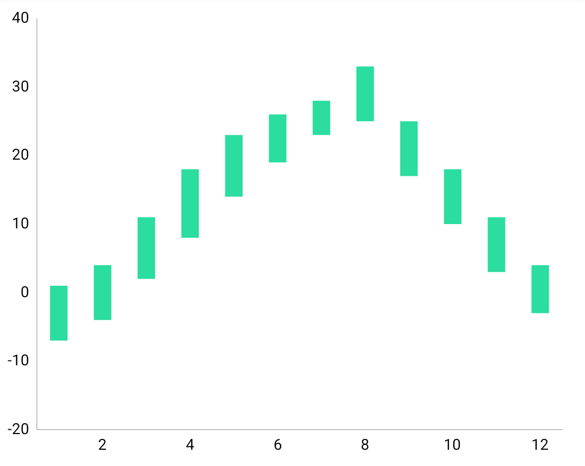
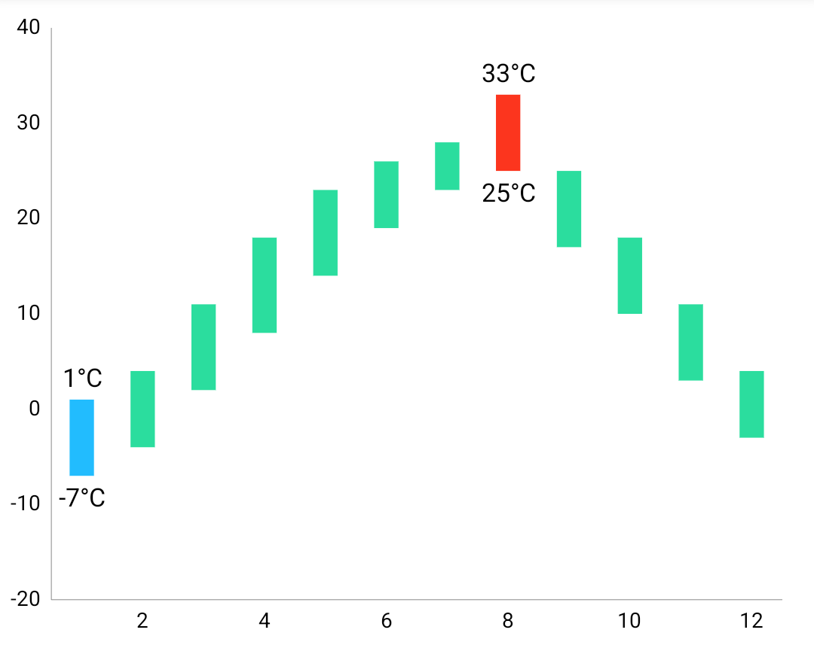
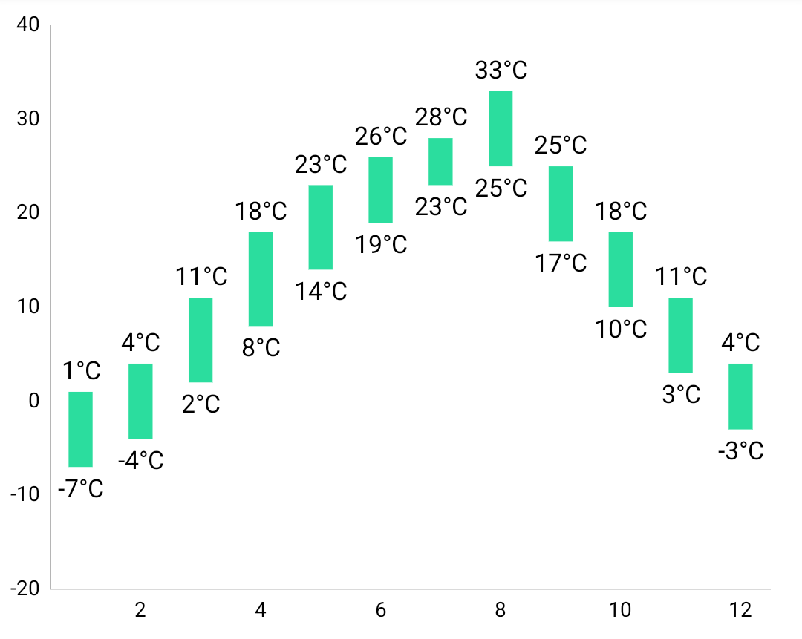
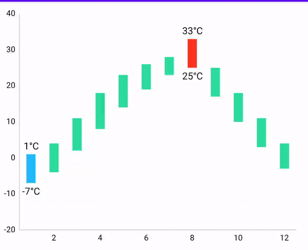

# RangeBarChart 
⚡ Range bar chart library for Android using [MPAndroidChart](https://github.com/PhilJay/MPAndroidChart)⚡

- There were no charts in [MPAndroidChart](https://github.com/PhilJay/MPAndroidChart)  to show ranges.
- We were forced to show the range charts we wanted using a similarly capable candlestick chart.
- This library can be used when you want to create charts that can represent ranges such as weather and heart rate.


|    Default    |    Min/Max    |    Draw Label    |
| :----------------:| :----------------: | :----------------: |
| | || 
</br></br>

## Demo


</br></br>

## Setup

### Gradle
[](https://search.maven.org/search?q=g:%22io.github.ParkSangGwon%22%20AND%20a:%range-bar-chart%22)

```gradle

repositories {
  google()
  mavenCentral()
}

dependencies {
    implementation 'io.github.ParkSangGwon:range-bar-chart:x.y.z'
    //implementation 'io.github.ParkSangGwon:range-bar-chart:0.0.6'
}

```

If you think this library is useful, please press star button at upside. </br>


</br></br>

## How to use
- The usage of this library is perfectly consistent with that of [MPAndroidChart](https://github.com/PhilJay/MPAndroidChart)
- Please read [official document](https://weeklycoding.com/mpandroidchart-documentation/)
- A detailed explanation can be understood immediately by looking at the code of the sample project.

## RangeBarEntry
- min
- max

## Setup Chart
```kotlin
private fun RangeBarChart.setup() {
    setScaleEnabled(false)
    setDrawGridBackground(false)
    setBackgroundColor(Color.TRANSPARENT)
    description.isEnabled = false
    xAxis.apply {
        position = XAxis.XAxisPosition.BOTTOM
        setDrawGridLines(false)
    }
    axisLeft.apply {
        setDrawGridLines(false)
        axisMinimum = -20f
        axisMaximum = 40f
    }
    axisRight.isEnabled = false
    legend.isEnabled = false
    data = RangeBarData(createSet())
}
```

## Create DataSet
```kotlin
RangeBarDataSet(null, "RangeBar").apply {
    color = Color.parseColor("#2BDD9E")
    barWidth = 0.4f
    isHighlightEnabled = true
    highLightColor = Color.CYAN
    minColor = Color.parseColor("#22BCFE")
    maxColor = Color.parseColor("#FC351E")
    setDrawValues(false)
    valueTextSize = 12f
    valueFormatter = object : ValueFormatter() {
        override fun getFormattedValue(value: Float): String = "${value.toInt()}°C"
    }
}
```
## Add your entries
```kotlin
private fun getWeatherEntries(): List<RangeBarEntry> {
    val values = mutableListOf<RangeBarEntry>()
    values.add(RangeBarEntry(1f, -7f, 1f))
    values.add(RangeBarEntry(2f, -4f, 4f))
    values.add(RangeBarEntry(3f, 2f, 11f))
    values.add(RangeBarEntry(4f, 8f, 18f))
    values.add(RangeBarEntry(5f, 14f, 23f))
    values.add(RangeBarEntry(6f, 19f, 26f))
    values.add(RangeBarEntry(7f, 23f, 28f))
    values.add(RangeBarEntry(8f, 25f, 33f))
    values.add(RangeBarEntry(9f, 17f, 25f))
    values.add(RangeBarEntry(10f, 10f, 18f))
    values.add(RangeBarEntry(11f, 3f, 11f))
    values.add(RangeBarEntry(12f, -3f, 4f))
    return values
}
```
```kotlin
private fun RangeBarChart.addData() {
    val data = data ?: return
    val rangeBarDataSet = data.getDataSetByIndex(0) ?: return
    val values = getWeatherEntries()
    rangeBarDataSet.values = values
    data.notifyDataChanged()
    notifyDataSetChanged()
}
```

</br></br>


## Customize
### RangeBarDataSet

|      variable        |    Description    | 
| ----------------------- | ---------------- |
| `barWidth` | Adjust bard width |
| `minColor` | min color int |
| `maxColor` | max color int |

## FAQ

### Can I use BarChart's function/variable?
- Yes, RangeBarChart RangeBarChart is a class implemented by inheriting from BarChart.
- So you can use all the features that BarChart uses.


### How is it different from candlestick charts?
- Candle charts must specify a starting and ending point as well as a minimum and maximum.
- It is used for the purpose of using stock charts, not to display only the range we want.
- RangeBarChart only shows the minimum and maximum ranges.

</br></br>

## License

````code
Copyright 2022 Ted Park

Licensed under the Apache License, Version 2.0 (the "License");
you may not use this file except in compliance with the License.
You may obtain a copy of the License at

http://www.apache.org/licenses/LICENSE-2.0

Unless required by applicable law or agreed to in writing, software
distributed under the License is distributed on an "AS IS" BASIS,
WITHOUT WARRANTIES OR CONDITIONS OF ANY KIND, either express or implied.
See the License for the specific language governing permissions and
limitations under the License.```
````
